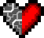
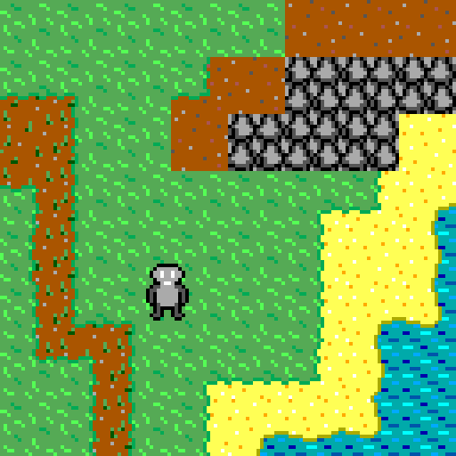

# Heartless 

It is about a little robot who is heartless literally 

Currently only compiling using MSVC! I will port it to linux and Mac some day, but not today.

**dependencies**
- [SDL2](https://libsdl.org/)
- [cereal](https://uscilab.github.io/cereal/)
- 

## planning 
- [x] scene system
  - [x] scene swapping
  - [x] tilemap world
    - [ ] world geration
    - [ ] dugeons and other structures  
  - [x] entity system
    - [ ] bosses, NPCs, etc. 
    - [ ] enemy ai
    - [ ] items
- [ ] level editor
- [x] gui system
  - [ ] touch and or controller support 
- [x] serialization
- [ ] story...

## art
more to come

